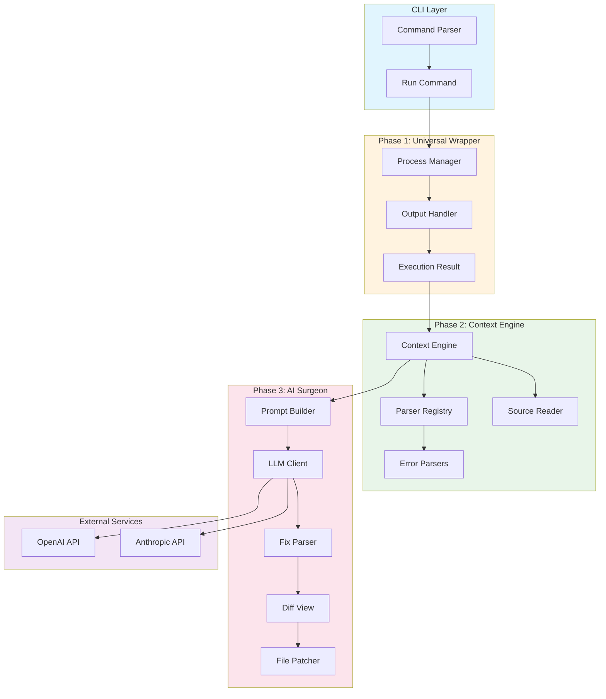
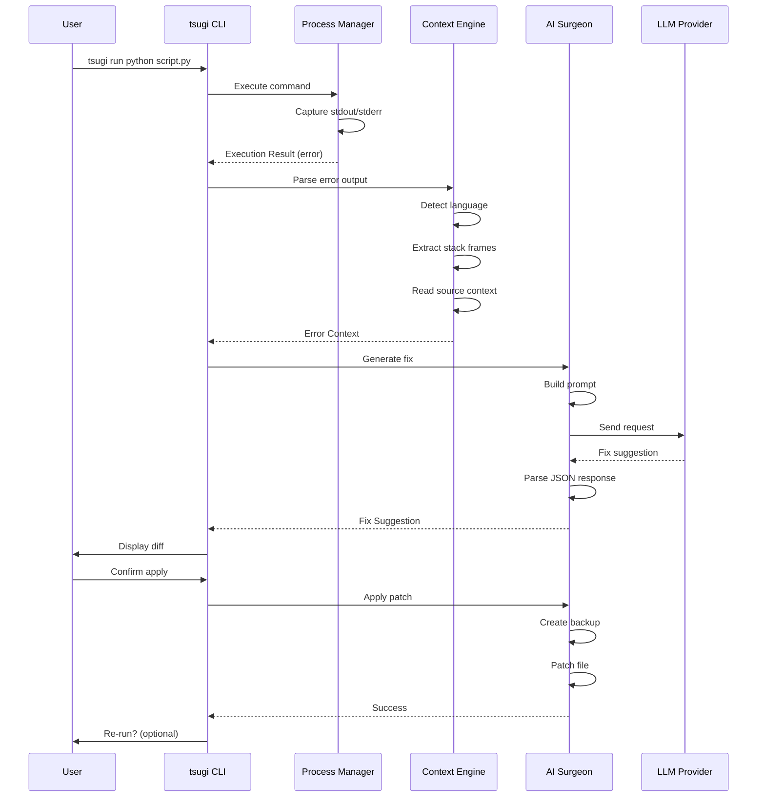
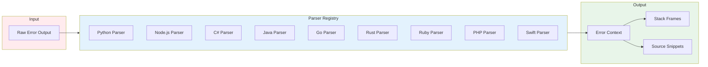
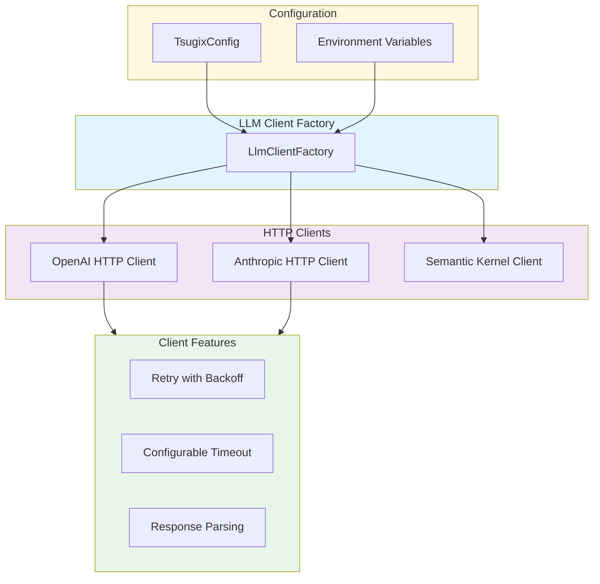

# Tsugix (tsugi)

<p align="center">
  <strong>A CLI tool that wraps any command, catches runtime errors, and uses AI to suggest and apply fixes automatically.</strong>
</p>

<p align="center">
  <a href="#installation">Installation</a> •
  <a href="#quick-start">Quick Start</a> •
  <a href="#features">Features</a> •
  <a href="#architecture">Architecture</a> •
  <a href="#documentation">Documentation</a>
</p>

<p align="center">
  
  
  
  
  
  
</p>

<p align="center">
  
  
  
  
</p>

--- 

## Tech Stack

| Category | Technology |
|----------|------------|
| **Runtime** | .NET 10, Native AOT |
| **Language** | C# 13 |
| **AI Providers** | OpenAI (GPT-4o), Anthropic (Claude) |
| **HTTP** | Direct HTTP Clients (AOT-compatible) |
| **Terminal UI** | Spectre.Console |
| **Process Management** | CliWrap |
| **Testing** | xUnit, FsCheck (Property-Based Testing) |
| **CI/CD** | GitHub Actions |

---

## Features

- **Universal Wrapper**: Wraps any command (Python, Node.js, C#, Java, Go, Rust, Ruby, PHP, Swift)
- **Smart Error Parsing**: Automatically detects language and parses stack traces
- **AI-Powered Fixes**: Uses OpenAI or Anthropic to analyze errors and suggest code fixes
- **Interactive Diff View**: Shows proposed changes with color-coded diff
- **Safe Patching**: Creates backups before modifying files, preserves encoding and line endings
- **Re-run Loop**: Optionally re-runs the command after applying fixes
- **Native AOT**: Compiles to native binaries for fast startup and minimal dependencies

---

## Architecture

Tsugix is built with a modular three-phase architecture:



### Component Flow



### Error Parser Architecture



### LLM Integration



---

## Installation

### From Source

```bash
# Clone and build
git clone https://github.com/SajidSadaqa/tsugix.git
cd tsugix
dotnet build src/Tsugix.sln

# Run directly
dotnet run --project src/Tsugix -- run python script.py
```

### Native AOT Binary

```bash
# Build native binary (requires .NET 10 SDK)

# Windows
dotnet publish src/Tsugix/Tsugix.csproj -c Release -r win-x64 --self-contained

# Linux
dotnet publish src/Tsugix/Tsugix.csproj -c Release -r linux-x64 --self-contained

# macOS (Intel)
dotnet publish src/Tsugix/Tsugix.csproj -c Release -r osx-x64 --self-contained

# macOS (Apple Silicon)
dotnet publish src/Tsugix/Tsugix.csproj -c Release -r osx-arm64 --self-contained

# Binary will be in: src/Tsugix/bin/Release/net10.0/{rid}/publish/tsugi
```

---

## Quick Start

```bash
# Set your API key
export OPENAI_API_KEY="sk-..."
# or
export ANTHROPIC_API_KEY="sk-ant-..."

# Run a command with tsugi
tsugi run python script.py
tsugi run node app.js
tsugi run dotnet run
```

When your command crashes, tsugi will:

1. Parse the error and stack trace
2. Extract source context from relevant files
3. Send to AI for analysis
4. Display a diff of the suggested fix
5. Ask for confirmation before applying
6. Optionally re-run the command

---

## Usage

```bash
# Basic usage
tsugi run <command> [args...]

# Options
tsugi run --skip-ai python script.py         # Skip AI analysis, just show error
tsugi run --auto-apply node app.js           # Auto-apply fixes without confirmation
tsugi run --auto-rerun dotnet run            # Auto-rerun after applying fix
tsugi run --no-rerun python test.py          # Skip re-run prompt
tsugi run --allow-outside-root ./script.py   # Allow patching files outside working dir
tsugi run --verbose python script.py         # Enable verbose logging
```

---

## Configuration

Create a `.tsugix.json` file in your project root or home directory:

```json
{
  "provider": "OpenAI",
  "model": "gpt-4o",
  "maxTokens": 4096,
  "timeout": 30,
  "autoBackup": true,
  "autoApply": false,
  "autoRerun": false,
  "temperature": 0.2
}
```

### Configuration Options

| Option | Default | Description |
| ------ | ------- | ----------- |
| `provider` | `OpenAI` | LLM provider (`OpenAI` or `Anthropic`) |
| `model` | `gpt-4o` | Model name |
| `endpoint` | `null` | Custom API endpoint URL (for Azure OpenAI, local proxies, etc.) |
| `maxTokens` | `4096` | Max tokens for prompt |
| `timeout` | `30` | API timeout in seconds |
| `autoBackup` | `true` | Create backup before patching |
| `autoApply` | `false` | Auto-apply fixes |
| `autoRerun` | `false` | Auto-rerun after fix |
| `temperature` | `0.2` | LLM temperature |
| `useSemanticKernel` | `false` | Use Semantic Kernel instead of direct HTTP |
| `rootDirectory` | (cwd) | Root directory for file operations |

---

## Supported Languages

| Language | Error Format | Parser |
| -------- | ------------ | ------ |
| Python | Traceback | `PythonErrorParser` |
| Node.js | Error stack | `NodeErrorParser` |
| C# | Exception stack trace | `CSharpErrorParser` |
| Java | Exception stack trace | `JavaErrorParser` |
| Go | panic/runtime error | `GoErrorParser` |
| Rust | panic/backtrace | `RustErrorParser` |
| Ruby | Exception backtrace | `RubyErrorParser` |
| PHP | Fatal error/Exception | `PhpErrorParser` |
| Swift | Fatal error | `SwiftErrorParser` |

---

## Security

### Path Safety

By default, tsugi only patches files within the current working directory. This prevents malicious AI responses from modifying system files or files outside your project.

- Files outside the root directory are rejected unless `--allow-outside-root` is specified
- Path traversal attempts (e.g., `../../../etc/passwd`) are blocked
- Absolute paths outside the root are rejected

### Prompt Injection Resistance

The AI prompts include security warnings to resist prompt injection attacks. However, always review suggested fixes before applying them.

### Backups

All file modifications create backups in `.tsugix/backup/{timestamp}/` by default. Backups preserve the original file content and can be used to restore files if needed.

### API Keys

API keys are read from environment variables only:

- `OPENAI_API_KEY` for OpenAI
- `ANTHROPIC_API_KEY` for Anthropic

Never commit API keys to version control.

---

## Development

```bash
# Build
dotnet build src/Tsugix.sln

# Run tests
dotnet test src/Tsugix.Tests

# Run specific tests
dotnet test src/Tsugix.Tests --filter "FullyQualifiedName~FilePatcher"

# Run with verbose output
dotnet test src/Tsugix.Tests --verbosity normal
```

### Project Structure

```text
src/
├── Tsugix/                    # Main application
│   ├── Commands/              # CLI command handlers
│   ├── Core/                  # Core types and interfaces
│   ├── Process/               # Process execution
│   ├── ContextEngine/         # Error parsing and context
│   │   ├── Models/            # Data models
│   │   └── Parsers/           # Language-specific parsers
│   └── AiSurgeon/             # AI integration
│       └── Http/              # HTTP clients for LLM APIs
└── Tsugix.Tests/              # Test project
    ├── Commands/
    ├── Core/
    ├── Process/
    ├── ContextEngine/
    ├── AiSurgeon/
    └── Integration/
```

### CI/CD

GitHub Actions workflow runs on every push:

- Build on Windows, Linux, and macOS
- Run all tests with code coverage
- Publish AOT binaries as artifacts (win-x64, linux-x64, osx-x64, osx-arm64)

---

## License

MIT
